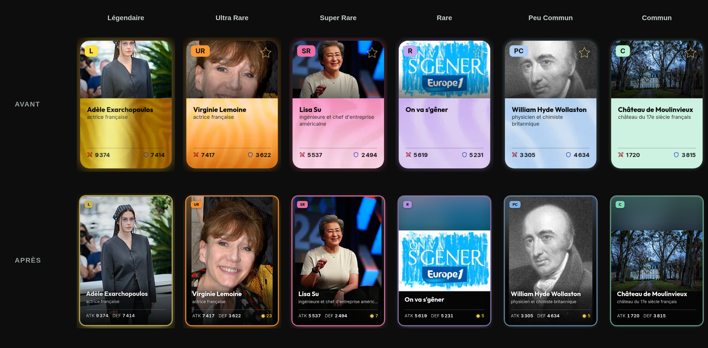
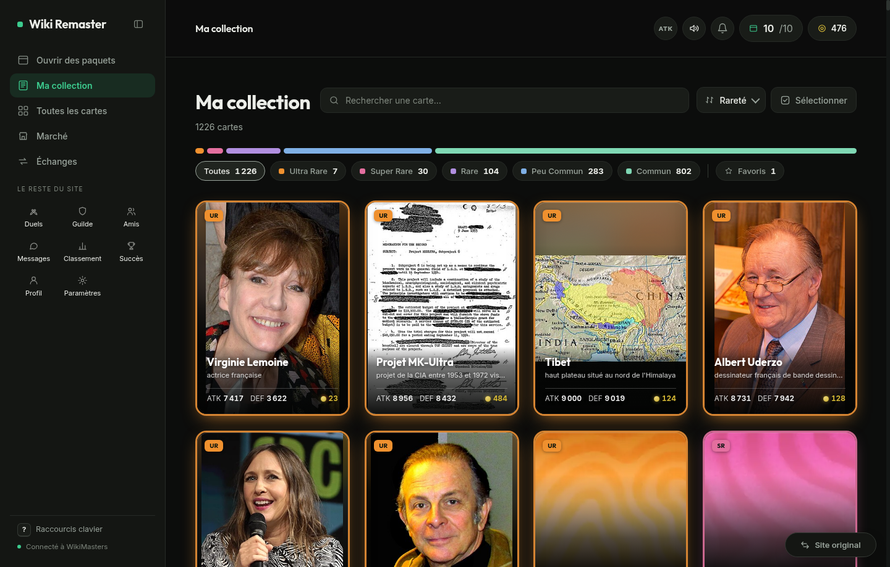
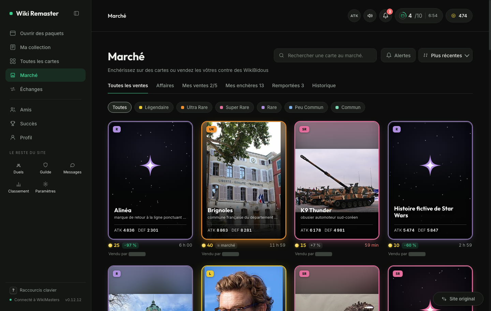
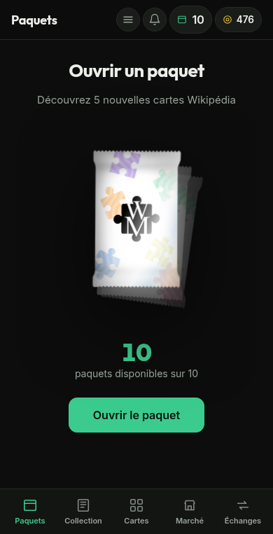
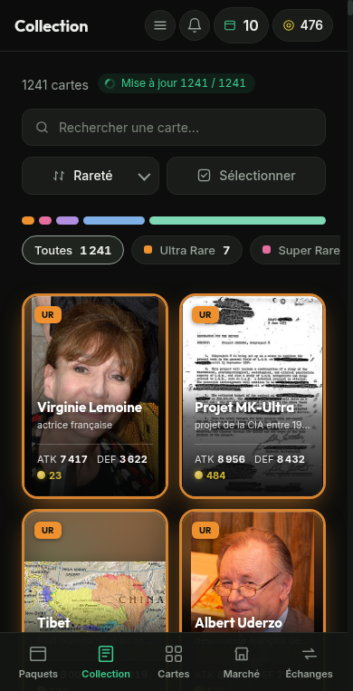
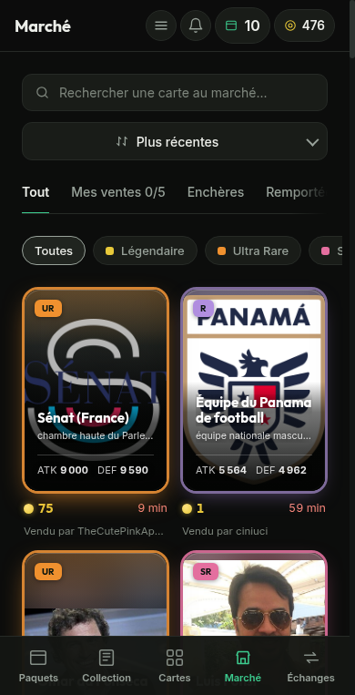

# Wiki Remaster

An unofficial redesign of [wiki-masters.com](https://www.wiki-masters.com), in your browser, on the game's own data and your own session.



## Install

[](https://raw.githubusercontent.com/KazeTachinuu/wiki-remaster/main/wm-userscript/dist/wikimasters-app.user.js)

| Device | How |
|---|---|
| Computer | [Tampermonkey](https://www.tampermonkey.net/), then the button above |
| Android | Firefox + Tampermonkey add-on, then the button |
| iPhone | Safari + [Userscripts](https://apps.apple.com/app/userscripts/id1463298887) (Settings, Safari, Extensions) |
| Extension (no Tampermonkey) | `./build.sh`, then load `wm-userscript/dist/chrome` or `dist/firefox` unpacked |

Updates are automatic. **Site original** (or the phone menu) goes back to the original site.

## What's new

- **Packs**: tear-open reveal, rarity sounds, next-pack countdown on every screen, Pro daily pack
- **Collection**: search, sort, filters, bulk discard, instant load
- **Catalogue**: all 2.8 M cards, server search, wishlist
- **Card detail**: market price, last sale, best deal, quick-sale price, price chart
- **Market**: live bids, your sales and wins, every listing of a card side by side
- **Trades**: real cards with values and a verdict, counter-offer timeline, chat
- **Phone**: app layout with a bottom tab bar



<p>
  
  
</p>
<p>
  
  
  
</p>

## Development

```
cd wm-userscript && bun install
bun run dev                    # localhost:5173, mock API
bun run build                  # dist/wikimasters-app.user.js
bun test src                   # unit tests
bun run check                  # style check
bun run test:prod:login        # once: log in to the game
bun run test:prod              # build on the real site, read-only
bun scripts/readme-shots.mjs   # README screenshots, read-only
```

- Mock faults: `POST /api/__fault` (`{ "status": 525, "count": 2 }`, `{ "delay": 7000 }`, `{ "human": true }`); Pro / V.I.P.: `POST /api/__profile`
- `test:prod` diffs API shapes against `docs/api-shapes.json` (`--update-shapes`, `--only=market,trades`, `--write=discard,sell,bid,notif`)
- API reference: [docs/API_REFERENCE.md](docs/API_REFERENCE.md)

## Legal

- Unofficial, not affiliated with WikiMasters. Game art belongs to its owners.
- Card text from Wikipedia, [CC BY-SA 4.0](https://creativecommons.org/licenses/by-sa/4.0/).
- Code: [MIT](LICENSE) · [Privacy](PRIVACY.md) · [Store kit](docs/STORE.md)
