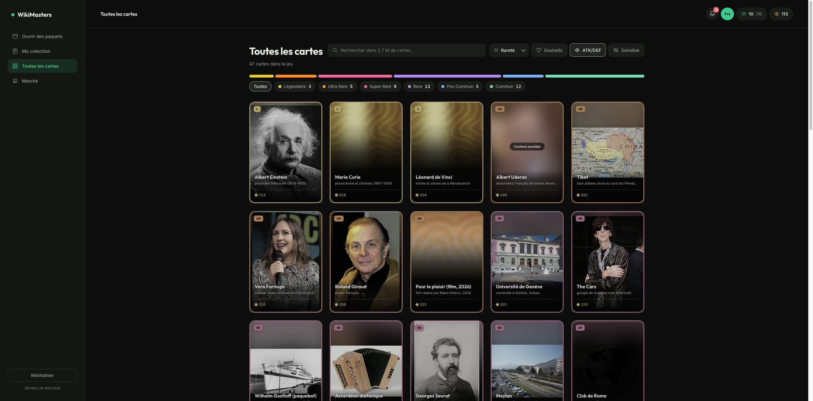

# wiki-remaster

A userscript that reskins wiki-masters.com with a custom UI, running on the site's real API and your logged-in session. Redesigned screens overlay the site; other routes fall back to the original.



## Install
1. Install the [Tampermonkey](https://www.tampermonkey.net/) browser extension.
2. Click **[Install](https://raw.githubusercontent.com/KazeTachinuu/wiki-remaster/main/wm-userscript/dist/wikimasters-app.user.js)**; Tampermonkey will prompt to install.
3. Open [wiki-masters.com](https://www.wiki-masters.com).

It auto-updates when a new version is pushed here (the version number lives in the userscript header). Turn it off with "Version originale du site" in the sidebar.

Svelte 5, Vite, vite-plugin-monkey. Build output: `wm-userscript/dist/wikimasters-app.user.js`.

## Rebuilt screens
- Ouvrir des paquets: foil booster, open animation, reveal.
- Ma collection: search, sort, rarity and favourite filters, market value, bulk discard.
- Toutes les cartes: full catalog, server-side search and paging, rarity and wishlist filters.
- Marche: live auctions browse, filters, and real-time bidding (bid history, countdown, activity feed).
- Card detail: summary, stats, market chart.
- Nav, wallet, notifications.

Everything else falls back to the native site.

## Run
```
cd wm-userscript
npm install
npm run dev                  # open the printed URL, install in Tampermonkey, hot-reloads
npm run build                # dist/wikimasters-app.user.js
npm run check                # style check (no em dashes or glyph icons)
node ../mock-app/server.js   # mock API on :8799
```

`src/lib/data.js` uses the real API on wiki-masters.com and the mock locally, by hostname.

Runs against your real account. Writes not verified against the live API (create auction, buy, cancel, wishlist) open the original site instead of guessing.
