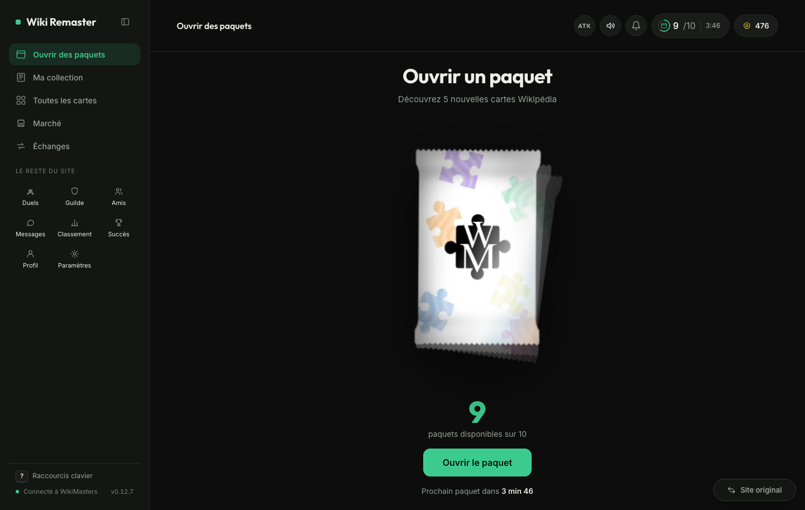
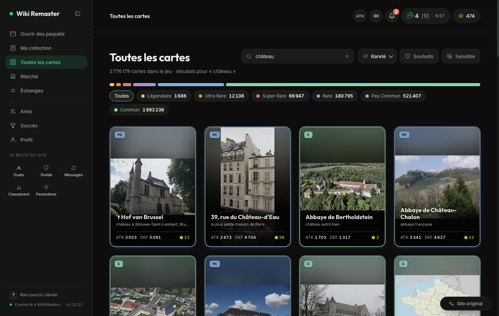
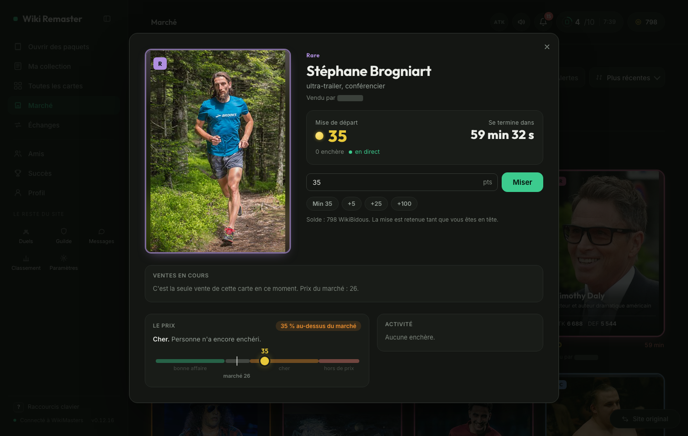
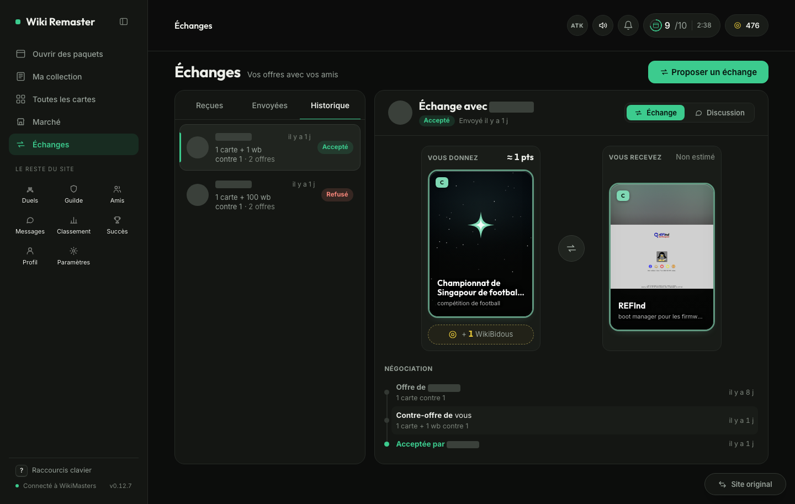

#  Wiki Remaster

An unofficial redesign of [wiki-masters.com](https://www.wiki-masters.com), in your browser, on the game's own data and your own session.


## Install

[](https://raw.githubusercontent.com/KazeTachinuu/wiki-remaster/main/wm-userscript/dist/wikimasters-app.user.js)

| Device | How |
|---|---|
| Computer | [Tampermonkey](https://www.tampermonkey.net/), then the button above |
| Android | Firefox + Tampermonkey add-on, then the button |
| iPhone | Safari + [Userscripts](https://apps.apple.com/app/userscripts/id1463298887) (Settings, Safari, Extensions) |
| Extension (no Tampermonkey) | `./build.sh`, then load `wm-userscript/dist/chrome` or `dist/firefox` unpacked |

Updates are automatic. **Site original** (or the phone menu) goes back to the original site.

## Screens

### Packs
Tear-open reveal with rarity sounds; the next-pack countdown and the Pro daily pack show from every screen.



### Collection
Search, sort, rarity filters, bulk discard; cached between visits.


### Card detail
Market price, last sale, cheapest copy on sale, a quick-sale price, the price chart.


### Catalogue
All 2.8 M cards, searched by the game's server, with your wishlist.



### Market
Live bids, your sales and wins, every listing of a card side by side.




### Trades
Both sides as real cards with their value and a verdict; counter-offers as one timeline.



### Phone
App layout with a bottom tab bar.

<p>
  
  
  
</p>

## Development

```
bun run dev                    # localhost:5173, the mock game (run from the repo root)
bun run build                  # everything: userscript, Chrome and Firefox packages
bun run test                   # unit tests
bun run check                  # style check
cd wm-userscript
bun run test:prod:login        # once: log in to the game
bun run test:prod              # build on the real site, read-only
bun scripts/readme-shots.mjs   # README screenshots, read-only
scripts/check-live.sh --install # daily live check: desktop alert + GitHub issue on failure
```

- Mock world: 6 players, 2 friend groups, a running market, trades and chats, from real cards (`mock/world.js`, `mock/snapshot.json`; refresh with `bun scripts/snapshot-prod.mjs`)
- Faster market: `WM_MOCK_MARKET_SPEED=60 bun run dev` (an hour a minute)
- Big mock collection: `WM_MOCK_CARDS=1000 bun run dev` (`WM_MOCK_SHINY=1` all shiny, `WM_MOCK_NOIMG=1` no pictures)
- Mock faults: `POST /api/__fault` (`{ "status": 525, "count": 2 }`, `{ "delay": 7000 }`, `{ "human": true }`); Pro / V.I.P.: `POST /api/__profile`
- `test:prod` diffs API shapes against `docs/api-shapes.json` (`--update-shapes`, `--only=market,trades`, `--write=discard,sell,bid,notif`)
- API reference: [docs/API_REFERENCE.md](docs/API_REFERENCE.md)

## Legal

- Unofficial, not affiliated with WikiMasters. Game art belongs to its owners.
- Card text from Wikipedia, [CC BY-SA 4.0](https://creativecommons.org/licenses/by-sa/4.0/).
- Code: [MIT](LICENSE) · [Privacy](PRIVACY.md) · [Store kit](docs/STORE.md)
