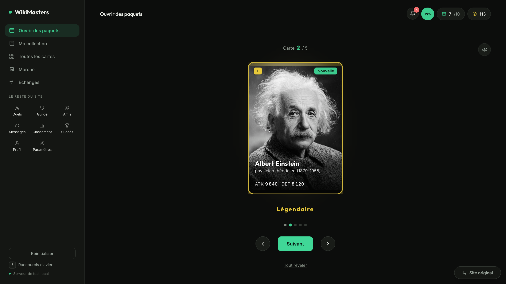
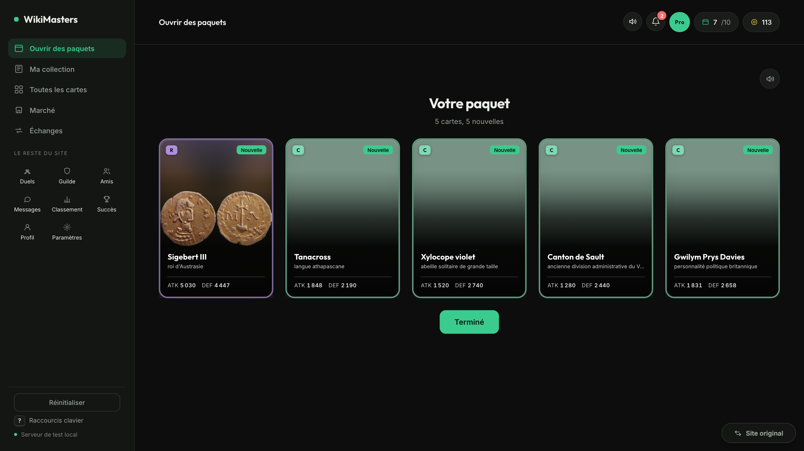
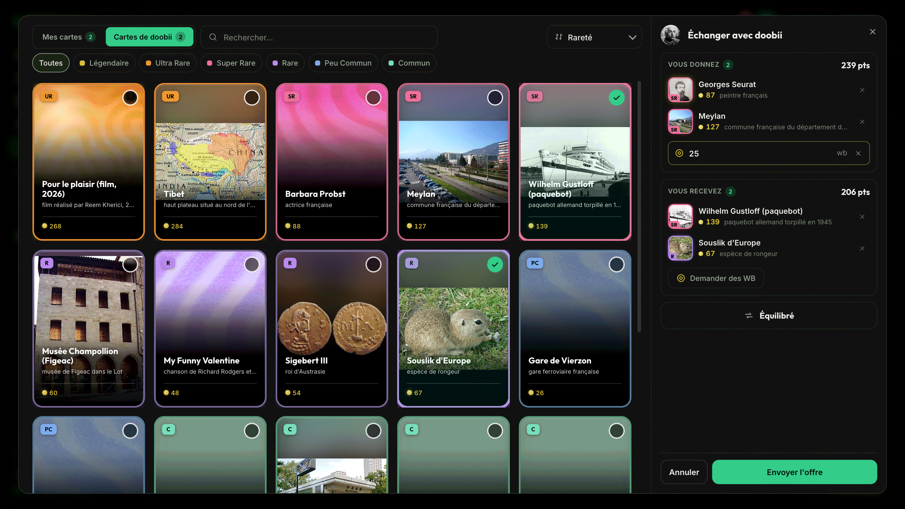
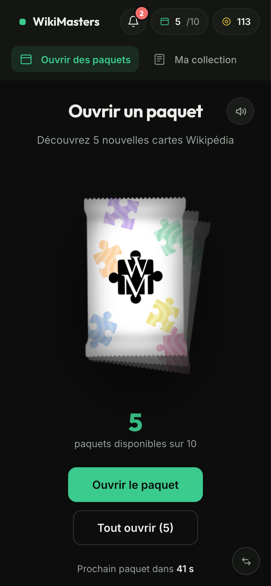
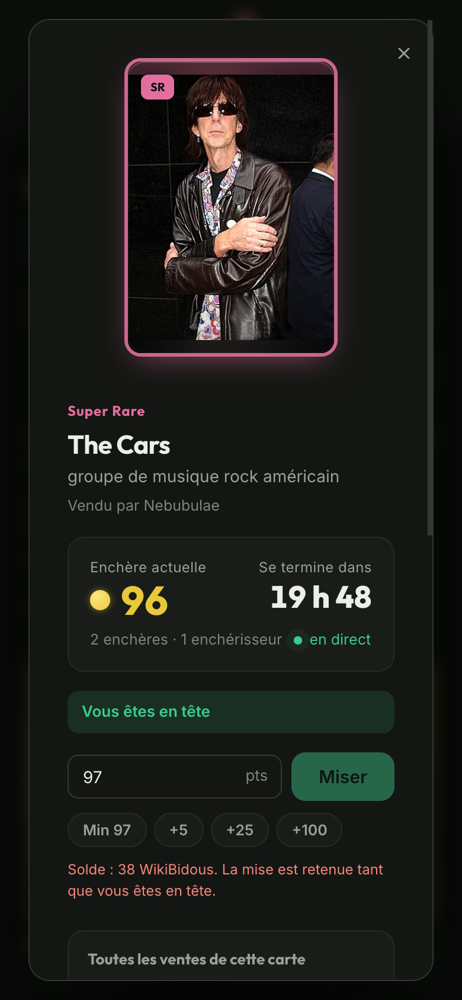
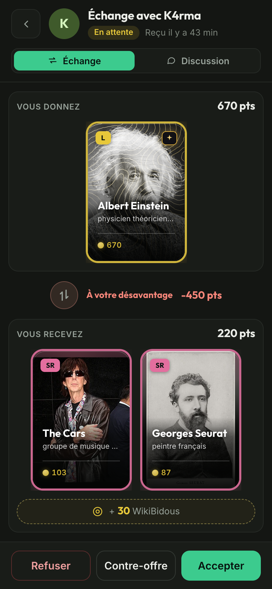

# wiki-remaster

A redesign of [wiki-masters.com](https://www.wiki-masters.com) that runs in your browser, on the game's real API and your own session. The redesigned screens replace the original ones; every other page stays the original site, one click away.


## Install

> Requires [Tampermonkey](https://www.tampermonkey.net/) (Chrome, Firefox, Edge).

[](https://raw.githubusercontent.com/KazeTachinuu/wiki-remaster/main/wm-userscript/dist/wikimasters-app.user.js)

Click the button, Tampermonkey opens an install page, click **Install**, then open [wiki-masters.com](https://www.wiki-masters.com). Updates install themselves.

The **Site original / Remaster** button in the bottom-right corner switches between the two at any time, on any page.

## What's redesigned

### Ouvrir des paquets

The real foil pack floats, shakes and bursts open. Cards are revealed one by one (Suivant, arrow keys or swipe) with a glow in their rarity's colour, or all at once. **Tout ouvrir** opens every pack and shows the whole haul, rarest first. With no packs left, the screen counts down to the next one.

Each moment has its own sound: the pack tears open, every card swishes, and its rarity answers with a sting that grows from a single note (Commune) to an opening chord with a rain of sparkles (Légendaire). The speaker in the top bar sets the volume and mutes everything; muting on the original site mutes it too.





### Ma collection

Search, sort (rarity, estimated value, ATK, DEF, name), filter by rarity, favourites or shiny cards, and select several cards to discard them at once. The rarity bar shows what the collection is made of. The collection is cached, so it opens instantly and refreshes in the background.

### Toutes les cartes

The full catalogue of 2.7 million cards, with server-side search, sorts, rarity filters and your wishlist. Cards you don't own yet are shown slightly faded.


### Marché

Browse every auction with sorts and rarity filters, bid live, and follow your sales, bids, wins and history (cancel, lower the price, finalize). When the same card is listed several times, an **xN** badge says so, and the auction shows **every live listing of that card** side by side: price, gap to the cheapest, time left and the average past sale price. Market notifications open the auction right here.


### Échanges

**Reçues**, **Envoyées** and **Historique** with your friends. Every trade shows what you give and what you receive as real cards, coins included, with an estimated value per side and a clear verdict (équilibré, à votre avantage, à votre désavantage). Accept, refuse or cancel with a confirmation, answer with a counter-offer pre-filled from the trade, propose a new trade from your cards and your friend's, and chat with them without leaving the screen.




### Card detail

Summary, stats, estimated market value with its price history, then sell (price suggestion, 1 h to 72 h) or discard. Card and info are split on the golden ratio.

### Everywhere

- **Never a frozen screen.** A glowing bar shows anything loading, and after a second a caption says what is happening, how long it has taken, and whether the game's server is slow.
- **Built for the game's bad days.** Its server sometimes fails (Cloudflare 525 errors, 17-second hangs). Loading retries by itself, actions are never sent twice, the last good data stays on screen, and a small "Serveur du jeu instable" pill appears only while it lasts.
- **The human check inside the remaster.** When the game asks to confirm you are human, the Cloudflare check appears in place and your action carries on once it passes.
- **Notifications** with toasts you can close, an unread count in the tab title, and **keyboard shortcuts** (press `?`).
- **Phone-ready**: one compact header, everything fits from 390 px wide.

<p>
  
  
  
  
</p>

## Development

```
cd wm-userscript
bun install
bun run dev                 # http://localhost:5173, with a mock of the game's API, hot reload
bun run build               # dist/wikimasters-app.user.js
bun test src                # unit tests
bun run check               # style check (no em dashes or glyph icons)
bun run test:prod:login     # once: log in to the game in a dedicated browser profile
bun run test:prod           # run the local build on the real site, read-only by default
```

The mock (`plugins/vite-mock-api.js`) serves the same routes and shapes as the live site, so dev runs the real adapter. `POST /api/__fault` makes it misbehave on purpose (`{ "status": 525, "count": 2, "match": "/api/cards" }`, `{ "delay": 7000 }`, `{ "human": true }`; `{}` clears it), to test retries, slow servers and the human check.

`test:prod` uses its own browser profile in `.prod-profile/` (Brave, else Chromium or Chrome; `WM_BROWSER` overrides it). `--only=estimate,market` picks features, `--write=discard,sell,bid,notif` opts into small real-account writes (see `scripts/prod-test.mjs`).

```
src/
  wm/              domain layer
    api.js         HTTP client: retries, timeouts, health, loading activity, session capture
    schema.js      normalizers and API drift detection
    trades.js      trade logic: tabs, side values, verdict, counter-offer chains
    compare.js     same-card market comparison
    cache.js       versioned localStorage cache
    index.js       adapter selection, cached market values and collection
    adapters/      real.js (wiki-masters.com), mock.js (dev: the real adapter minus Supabase)
  lib/             Svelte screens and shared pieces (Card, CardModal, LoadBar, HumanCheck, sound.js...)
  App.svelte main.js app.css
plugins/           vite-mock-api.js: the dev API
scripts/           prod-test.mjs (real-site checks), check-style.mjs
mock/catalog.js    dev card fixture
docs/              API reference, screenshots, design specs and plans
```

## Reference

Every endpoint, request and response shape: [docs/API_REFERENCE.md](docs/API_REFERENCE.md).
