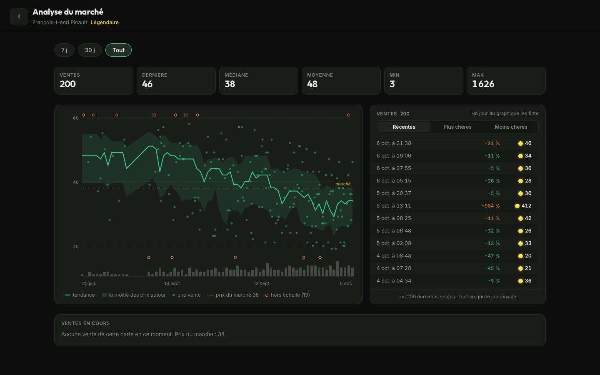
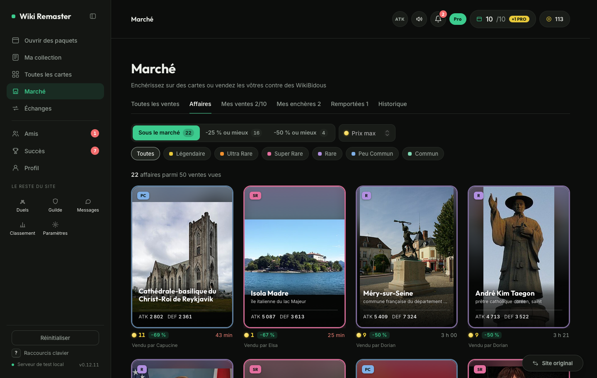
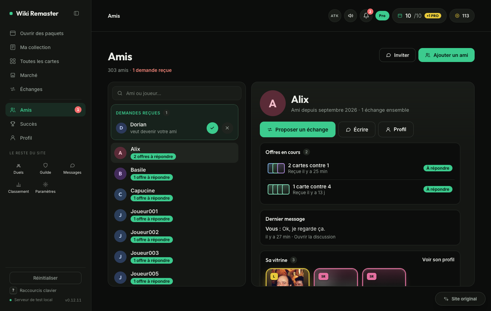
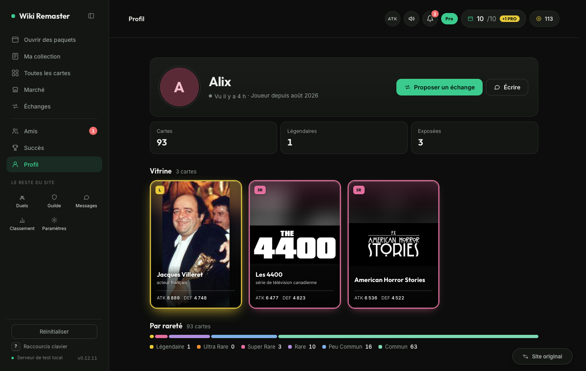
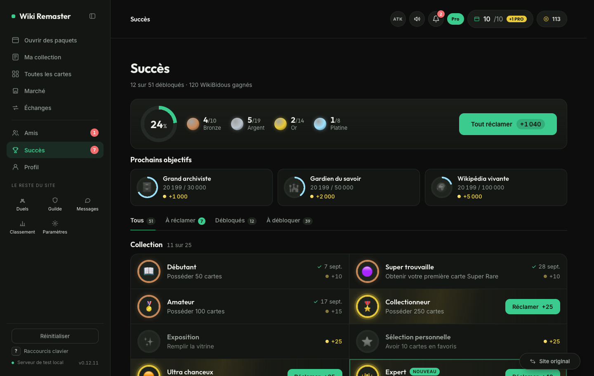
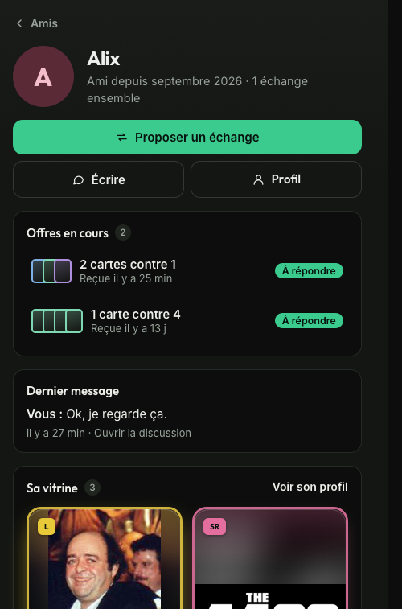
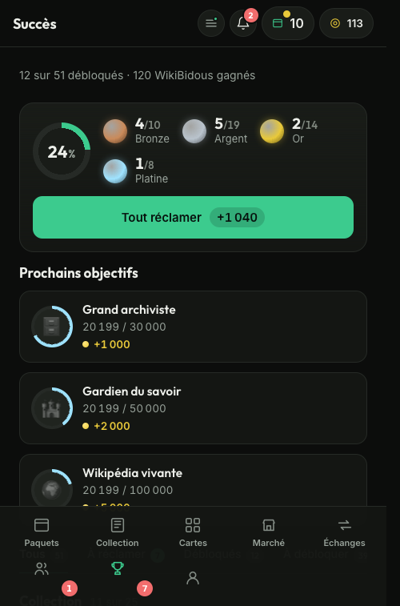

#  Wiki Remaster

An unofficial redesign of [wiki-masters.com](https://www.wiki-masters.com), in your browser, on the game's own data and your own session.


## Install

[](https://raw.githubusercontent.com/KazeTachinuu/wiki-remaster/main/dist/wikimasters-app.user.js)

| Browser | How |
|---|---|
| Chrome, Edge, Brave, Opera | Chrome Web Store (in review), or [Tampermonkey](https://www.tampermonkey.net/) then the button above |
| Firefox (computer and Android) | Firefox Add-ons (in review), or Tampermonkey then the button |
| Safari (iPhone, iPad, Mac) | [Userscripts](https://apps.apple.com/app/userscripts/id1463298887) (Settings, Safari, Extensions), then the button |

Updates are automatic, and the sidebar (or the phone menu) says when a new version is out. **Site original** goes back to the original site.

## Screens

### Packs
Tear-open reveal with rarity sounds (from the rarity you choose up); the next-pack countdown and the Pro daily pack show from every screen.


### Collection
Searched, filtered and sorted by the game's server one page at a time, like its own collection page: 20 000 cards open as fast as 50. By rarity, date added or name, favourites first; bulk discard.


### Card detail
Market price, last sale, cheapest copy on sale, a quick-sale price, the price trend.


### Market analysis (Pro)
Every sale of a card on one screen: a period (7 days, 30 days, all), the key figures, the trend with each sale and the daily volume, the sales beside it (click a day to list its own), and what is on sale now.



<sub>From the test server: the sale history is Pro only, and the screenshots' account is not Pro.</sub>

### Catalogue
All 2.8 M cards, searched by the game's server, with your wishlist.


### Market
Live bids, your sales and wins, every listing of a card side by side. Each price shows its gap to the card's market price; Affaires gathers the bargains among the sales seen (under the market, -25 %, -50 %, a price ceiling); alerts watch a search (« singapour », a rarity, a price) and tell you when a new sale shows up.




<sub>Affaires from the test server.</sub>

### Trades
Both sides as real cards with their value and a verdict; counter-offers as one timeline. Built for busy traders: find a trade by friend or card, hundreds of cards in a trade as mini cards, long negotiations folded.


### Friends and profiles
Friends as in a messaging app: the list, then the friend you pick with your offers in progress, the last message and their showcase, a trade or a message one click away. One search for friends and every player; requests counted on the menu. Every player's profile: last seen, collection by rarity, showcase as they arranged it, or a clean private state.





<sub>From the test server: its players are made up, so no real player shows here.</sub>

### Achievements
Every achievement with your progress where it can be counted, medals by tier, the next goals, every reward claimed in one go and counted on the menu. New achievements from the game show up with no update.



<sub>From the test server.</sub>

### Phone
App layout with a bottom tab bar; Amis, Succès and Profil in the menu.

<p>
  
  
  
</p>
<p>
  
  
</p>

## Development

```
bun run dev                    # localhost:5173, the mock game (run from the repo root)
bun run build                  # everything into dist/: userscript, Chrome and Firefox packages
bun run clean                  # remove what builds and tests generate
bun run test                   # unit tests
bun run check                  # style check
bun run publish:firefox        # build and submit to Firefox Add-ons (see docs/STORE.md)
cd wm-userscript
bun run test:prod:login        # once: log in to the game
bun run test:prod              # build on the real site, read-only
bun scripts/readme-shots.mjs   # README screenshots, read-only
scripts/check-live.sh --install # daily live check: desktop alert + GitHub issue on failure
```

- Mock world: 6 players, 2 friend groups, a running market, trades and chats, from real cards (`mock/world.js`, `mock/snapshot.json`; refresh with `bun scripts/snapshot-prod.mjs`)
- Faster market: `WM_MOCK_MARKET_SPEED=60 bun run dev` (an hour a minute)
- Big mock collection: `WM_MOCK_CARDS=20000 bun run dev` (`WM_MOCK_SHINY=1` all shiny, `WM_MOCK_NOIMG=1` no pictures)
- Power user: `WM_MOCK_FRIENDS=300 WM_MOCK_TRADES=900 WM_MOCK_CHAIN=150 bun run dev` (friends, trades, one negotiation of 150 offers)
- Mock faults: `POST /api/__fault` (`{ "status": 525, "count": 2 }`, `{ "delay": 7000 }`, `{ "human": true }`); Pro / V.I.P.: `POST /api/__profile`
- `test:prod` diffs API shapes against `docs/api-shapes.json` (`--update-shapes`, `--only=market,trades`, `--write=discard,sell,bid,notif`)
- API reference: [docs/API_REFERENCE.md](docs/API_REFERENCE.md)

## Legal

- Unofficial, not affiliated with WikiMasters. Game art belongs to its owners.
- Card text from Wikipedia, [CC BY-SA 4.0](https://creativecommons.org/licenses/by-sa/4.0/).
- Code: [MIT](LICENSE) · [Privacy](PRIVACY.md) · [Publishing](docs/STORE.md)
